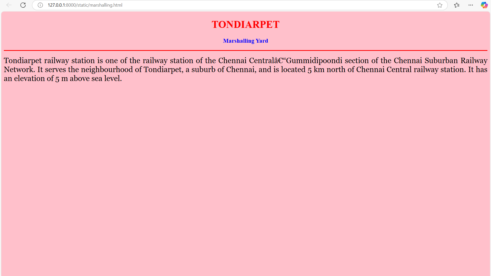
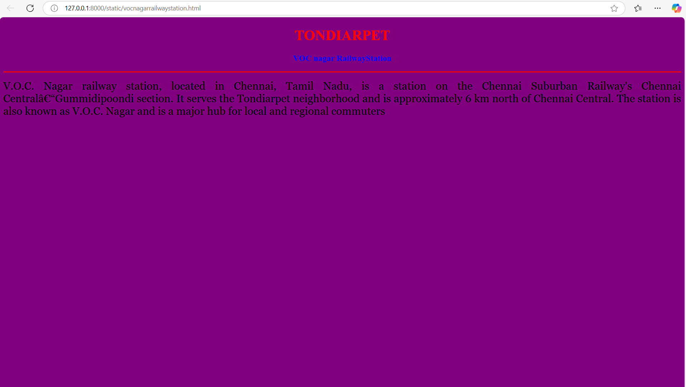
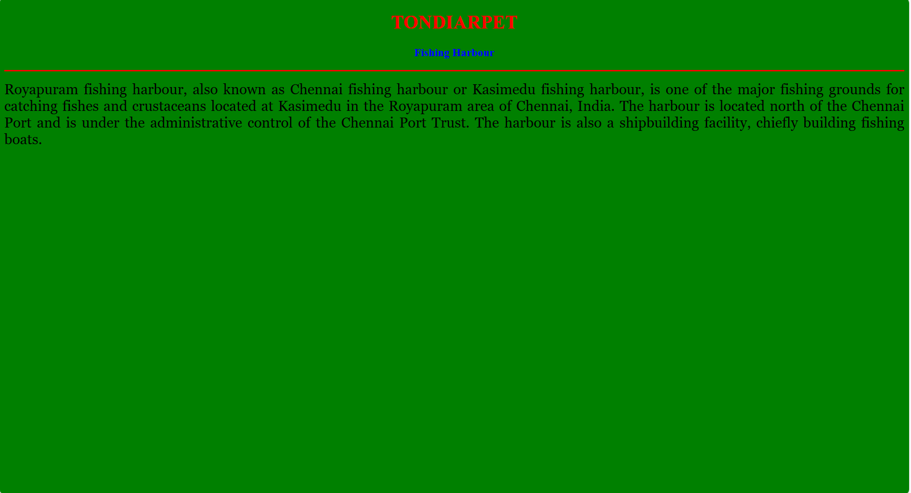
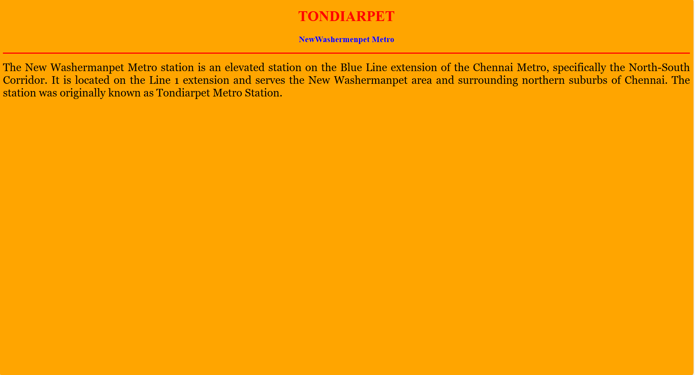
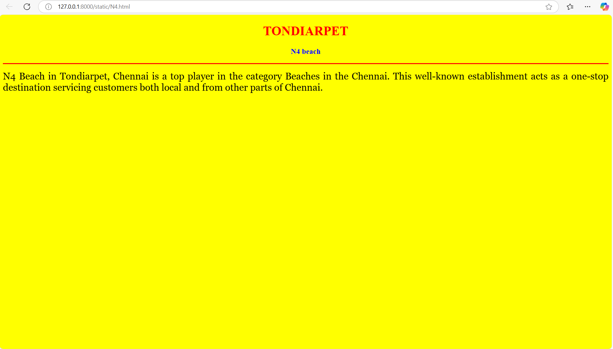
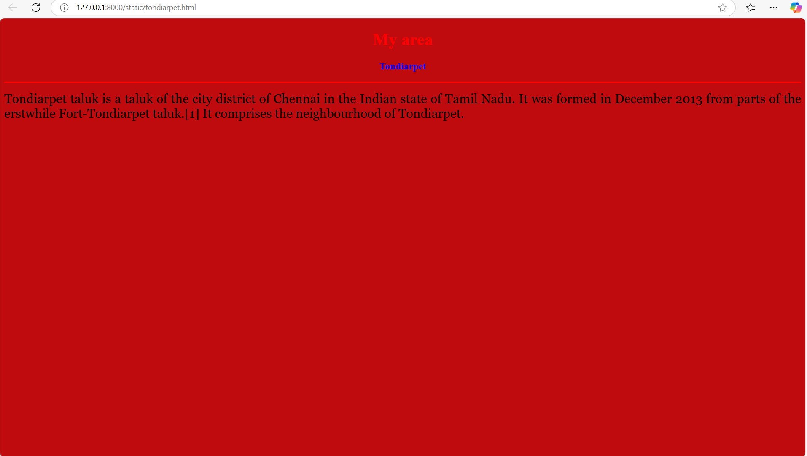

# Ex04 Places Around Me
## REG NO:212224040196
## Date: 22-04-25

## AIM
To develop a website to display details about the places around my house.

## DESIGN STEPS

### STEP 1
Create a Django admin interface.

### STEP 2
Download your city map from Google.

### STEP 3
Using ```<map>``` tag name the map.

### STEP 4
Create clickable regions in the image using ```<area>``` tag.

### STEP 5
Write HTML programs for all the regions identified.

### STEP 6
Execute the programs and publish them.

## CODE

```
map.html

<!DOCTYPE html>
<html>
<head>
    <title>My City</title>
</head>
<body>
    <h1 align="center"><font color="red"><b>TONDIARPET</b></font></h1>

    <h3 align="center"><font color="blue"><b>MOHAMMED YAASIR (212224040196)</b></font></h3>

    

    <map name="MyCity">
        <area target="_blank" alt="MY AREA" title="MY AREA" href="tondiarpet.html" coords="149,564,372,601" shape="rect">
    <area target="_blank" alt="N4 beach" title="N4 beach" href="N4.html" coords="791,396,145" shape="circle">
    <area target="_blank" alt="NewWashermenpet metro" title="NewWashermenpet metro" href="newwashermenpetmetro.html" coords="420,289,92" shape="circle">
    <area target="_blank" alt="Fishing Harbour" title="Fishing Harbour" href="fishingharbour.html" coords="492,480,659,542" shape="rect">
    <area target="_blank" alt="VOC nagar RailwayStation" title="VOC nagar RailwayStation" href="vocnagarrailwaystation.html" coords="197,73,74" shape="circle">
    <area target="_blank" alt="Marshalling Yard" title="Marshalling Yard" href="marshalling.html" coords="20,233,202,170" shape="rect">
    </map>
</body>
</html>

marshalling.html

<!DOCTYPE html>
<html>
<head>
    <title>My Home Town</title>
</head>
<body bgcolor="pink">
    <h1 align="center">
        <font color="red"><b>TONDIARPET</b></font>
    </h1>
    <h3 align="center">
        <font color="blue"><b>Marshalling Yard</b></font>
    </h3>
    <hr size="3" color="red">
    <p align="justify">
        <font face="Georgia" size="5">
            Tondiarpet railway station is one of the railway station of the Chennai Central–Gummidipoondi section of the Chennai Suburban Railway Network. It serves the neighbourhood of Tondiarpet, a suburb of Chennai, and is located 5 km north of Chennai Central railway station.
             It has an elevation of 5 m above sea level.
        </font>
    </p>
</body>
</html>

vocnagarrailwaystation.html

<!DOCTYPE html>
<html>
<head>
    <title>My Area</title>
</head>
<body bgcolor="purple">
    <h1 align="center">
        <font color="red"><b>TONDIARPET</b></font>
    </h1>
    <h3 align="center">
        <font color="blue"><b>VOC nagar RailwayStation</b></font>
    </h3>
    <hr size="3" color="red">
    <p align="justify">
        <font face="Georgia" size="5">
            V.O.C. Nagar railway station, located in Chennai, Tamil Nadu, is a station on the Chennai Suburban Railway's Chennai Central–Gummidipoondi section. It serves the Tondiarpet neighborhood and is approximately 6 km north of Chennai Central.
             The station is also known as V.O.C. Nagar and is a major hub for local and regional commuters
        </font>
    </p>
</body>
</html>

fishingharbour.html

<!DOCTYPE html>
<html>
<head>
    <title>My Area</title>
</head>
<body bgcolor="green">
    <h1 align="center">
        <font color="red"><b>TONDIARPET</b></font>
    </h1>
    <h3 align="center">
        <font color="blue"><b>Fishing Harbour</b></font>
    </h3>
    <hr size="3" color="red">
    <p align="justify">
        <font face="Georgia" size="5">
            Royapuram fishing harbour, also known as Chennai fishing harbour or Kasimedu fishing harbour, is one of the major fishing grounds for catching fishes and crustaceans located at Kasimedu in the Royapuram area of Chennai, India. The harbour is located north of the Chennai Port and is under the administrative control of the Chennai Port Trust.
             The harbour is also a shipbuilding facility, chiefly building fishing boats.
        </font>
    </p>
</body>
</html>

newwashermenpetmetro.html

<!DOCTYPE html>
<html>
<head>
    <title>My Area</title>
</head>
<body bgcolor="orange">
    <h1 align="center">
        <font color="red"><b>TONDIARPET</b></font>
    </h1>
    <h3 align="center">
        <font color="blue"><b>NewWashermenpet Metro</b></font>
    </h3>
    <hr size="3" color="red">
    <p align="justify">
        <font face="Georgia" size="5">
            The New Washermanpet Metro station is an elevated station on the Blue Line extension of the Chennai Metro, specifically the North-South Corridor. It is located on the Line 1 extension and serves the New Washermanpet area and surrounding northern suburbs of Chennai.
             The station was originally known as Tondiarpet Metro Station.
        </font>
    </p>
</body>
</html>

N4.html

<!DOCTYPE html>
<html>
<head>
    <title>My Area</title>
</head>
<body bgcolor="yellow">
    <h1 align="center">
        <font color="red"><b>TONDIARPET</b></font>
    </h1>
    <h3 align="center">
        <font color="blue"><b>N4 beach</b></font>
    </h3>
    <hr size="3" color="red">
    <p align="justify">
        <font face="Georgia" size="5">
            N4 Beach in Tondiarpet, Chennai is a top player in the category Beaches in the Chennai.
            This well-known establishment acts as a one-stop destination servicing customers both local and from other parts of Chennai.
        </font>
    </p>
</body>
</html>

tondiarpet.html

<!DOCTYPE html>
<html>
<head>
    <title>My Area</title>
</head>
<body bgcolor="cyanblue">
    <h1 align="center">
        <font color="red"><b>My area</b></font>
    </h1>
    <h3 align="center">
        <font color="blue"><b>Tondiarpet</b></font>
    </h3>
    <hr size="3" color="red">
    <p align="justify">
        <font face="Georgia" size="5">
            Tondiarpet taluk is a taluk of the city district of Chennai in the Indian state of Tamil Nadu. 
            It was formed in December 2013 from parts of the erstwhile Fort-Tondiarpet taluk.[1] It comprises the neighbourhood of Tondiarpet.
        </font>
    </p>
</body>
</html>

```


## OUTPUT









## RESULT
The program for implementing image maps using HTML is executed successfully.
